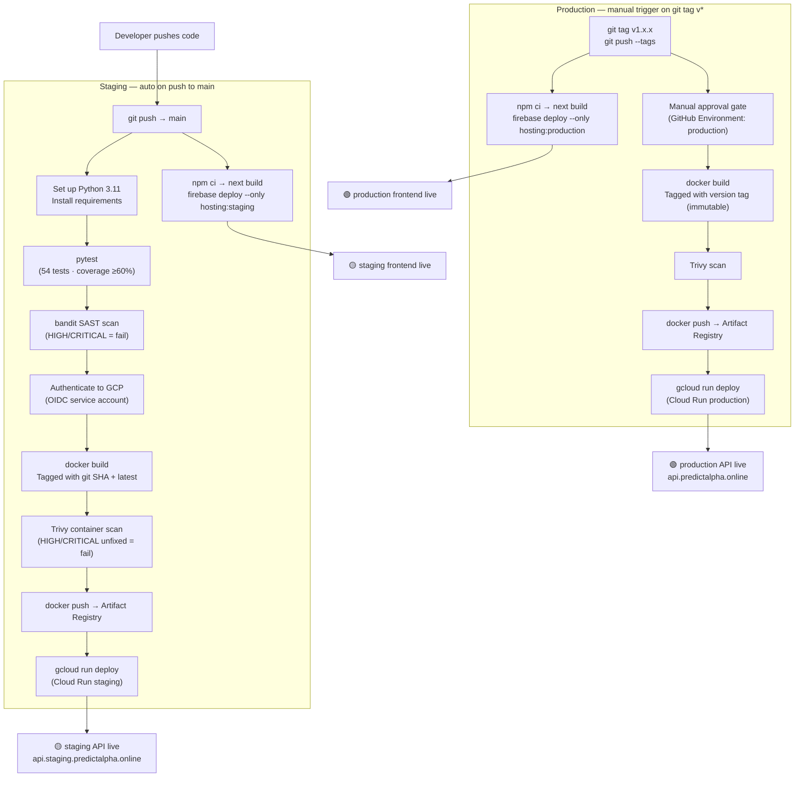

# CI/CD Pipeline



## Rollback Strategy

**Cloud Run**: Every deploy creates a new revision. Traffic split allows instant rollback:

```bash
# Roll back to previous revision
gcloud run services update-traffic predictive-alpha-api \
  --to-revisions=PREVIOUS_REVISION=100 \
  --region=us-west1

# Or gradual canary rollout
gcloud run services update-traffic predictive-alpha-api \
  --to-revisions=NEW=10,PREV=90 \
  --region=us-west1
```

**Helm (Kubernetes path)**:
```bash
helm rollback predictive-alpha 1  # roll back to revision 1
```

## Security Scanning Details

| Tool | Scope | Fail Condition |
|---|---|---|
| **pytest** | Unit + integration tests | Any failure or coverage < 60% |
| **bandit** | Python SAST — app/ source | HIGH or CRITICAL severity finding |
| **Trivy** | Docker image CVE scan | Unfixed HIGH or CRITICAL CVE |
