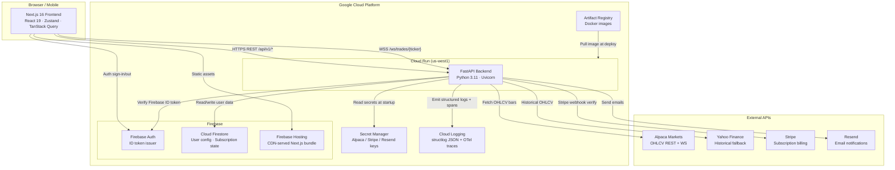

# System Overview

C4 context diagram — Predictive Alpha platform.

## Key Design Decisions

| Decision | Choice | Rationale |
|---|---|---|
| Compute | Cloud Run (serverless) | Zero-ops scaling; no idle cost; instant revision rollback |
| Auth | Firebase ID tokens | Managed OAuth; row-level Firestore rules tied to UID |
| Database | Firestore | Schemaless user config; no migration overhead; owner-only ACL built-in |
| Secrets | Secret Manager | Injected at deploy time; zero code changes to rotate |
| Caching | In-process TTLCache | Sufficient for single-instance; Redis path documented for scale-out |
| WS registry | In-memory dict | Correct for Cloud Run single-process; Redis pub/sub for multi-instance |
