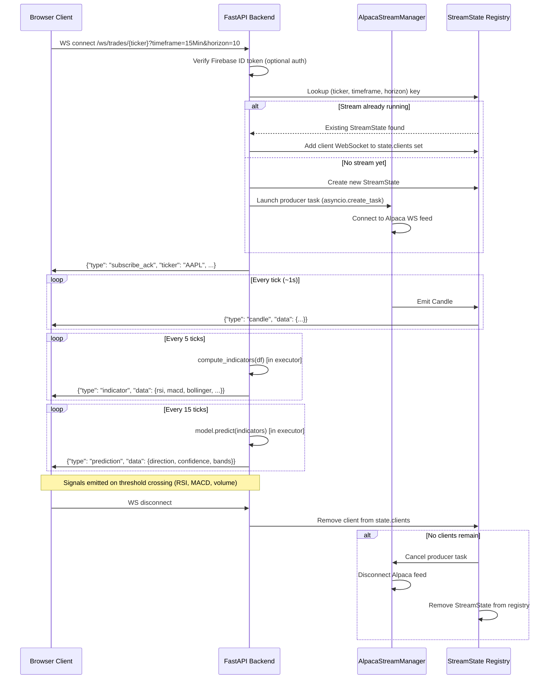

# WebSocket Data Flow

Sequence diagram for a client subscribing to live market data.

## Scaling Note

The current in-memory `_streams` registry is **single-process only**.  
Cloud Run scales each service to one instance per request burst — if multiple  
instances run, clients on different instances won't receive each other's ticks.

**Production path**: Replace `_streams` dict with a Redis pub/sub channel keyed  
by `(ticker, timeframe)`. Each instance subscribes; the producer runs on exactly  
one instance (via a distributed lock).
